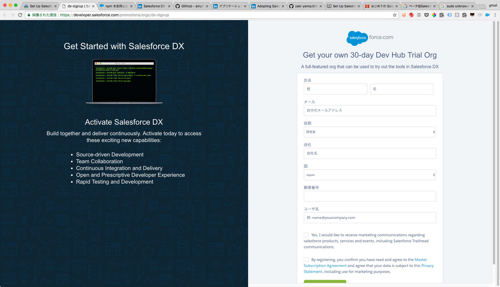

1. Set Up Salesforce DX
=======================

ここでは、

* Dev Hub と Scratch Org を理解する
* Dev Hub を作成する
* Scratch Org を作成する


## 用語の整理

### Dev Hub

Scratch Org の作成と管理をするために必要なハブ組織です。


## Dev Hub を作成する

それでは、さっそく Dev Hub を作成しましょう。  
現在 Dev Hub を取得するための手段は

1. https://developer.salesforce.com/promotions/orgs/dx-signup から 30 日間有効なトライアル組織にサインアップする
2. （会社で利用している）本番組織で Dev Hub 機能を有効化する

の 2 つの方法がありますが、今回は 1 の方法でトライアル用の組織を取得します。



通常の Developer Edition 組織と同じように、フォームに必要事項を記入してサインアップするとメールが届くはずです。


## CLI をインストールする

続いて、CLI をインストールします。  
OS によってインストール URL が異なるので、 Trailhead の [Install the Command Line Interface (CLI)](https://trailhead.salesforce.com/ja/modules/sfdx_app_dev/units/sfdx_app_dev_setup_dx#Tdxn4tBK-heading6) の URL を確認してください。

インストールが完了したら、ターミナルで `sfdx` コマンドを実行してみましょう。  
（初回実行時はアップデートが走って少し遅いかもしれません）


```
$ sfdx
sfdx-cli: Updating to 6.0.16-3780698... 21.4 MB/21.4 MB
Usage: sfdx COMMAND

Help topics, type sfdx help TOPIC for more details:

 force    tools for the Salesforce developer
 plugins  manage plugins
 update   update CLI
```

このようなメッセージが表示されれば OK です。

CLI は基本的に

```
$ sfdx force:...
```

から始まるコマンドになっています。またコマンドの一覧は

```
$ sfdx force:doc:commands:list
```

で確認できます。

## Dev Hub にログインする

無事に CLI がインストールできたので、まず CLI 経由で Dev Hub にログインし認証を通しておきます。  
これには `sfdx force:auth:web:login` というコマンドを使います。

次のコマンドを実行します。

```
$ sfdx force:auth:web:login -d -a DevHub

# オプション：
  -d: これをデフォルトの Dev Hub にする
  -a: エイリアス。自分で管理しやすいよう任意の名前をつける
```

ブラウザでログイン画面が開くので、先ほど作成した Dev Hub のユーザ名とパスワードを入力してログインします。  
その後アプリケーションの許可を求められるので許可しましょう。

ターミナルには以下のようなメッセージが表示されているはずです。

```
Successfully authorized admin@yama.sfdx-hands-on.com with org ID 00D7F000003epUqUAI
You may now close the browser
```

`force:auth:web:login` は Dev Hub 専用のコマンドというわけではなく、任意の組織を認証することができます。  
認証した組織は `force:org:open` コマンドを使ってユーザ名・パスワードを入力することなく開くことができるようになります。

```
$ sfdx force:org:open -u DevHub

# オプション：
  -u: auth:web:login 時につけたエイリアス
```

開発用の Sandbox などよく利用する組織がある場合は、このコマンドを使って認証を通しておくと毎回のログインが楽になりますね。  
~~この長いコマンドを打つのとどっちが楽なんだというのはありますが~~

また、組織の一覧は `force:org:list` コマンドで確認できます。


```
$ sfdx force:org:list
=== Orgs
     ALIAS         USERNAME                                     ORG ID              CONNECTED STATUS
───  ────────────  ───────────────────────────────────────────  ──────────────────  ────────────────
                   admin@yama.dev-hub.com                       00D7F000000ykQEUAY  ENOTFOUND
                   scratchorg1487912703272@yourcompany.com      00D3D0000000NcUUAU  invalid_grant
     DXPlayground  shingoyamazaki@raccoon-459484.com            00D7F000000z2g6UAA  Connected
(D)  DevHub        admin@yama.20171127-dx-handson.com           00D7F000003epUqUAI  Connected
```

## おつかれさまでした！

この章はこれで終了です。  
ここまでの内容で Challenge も回答できるはずなので挑戦してみましょう。
