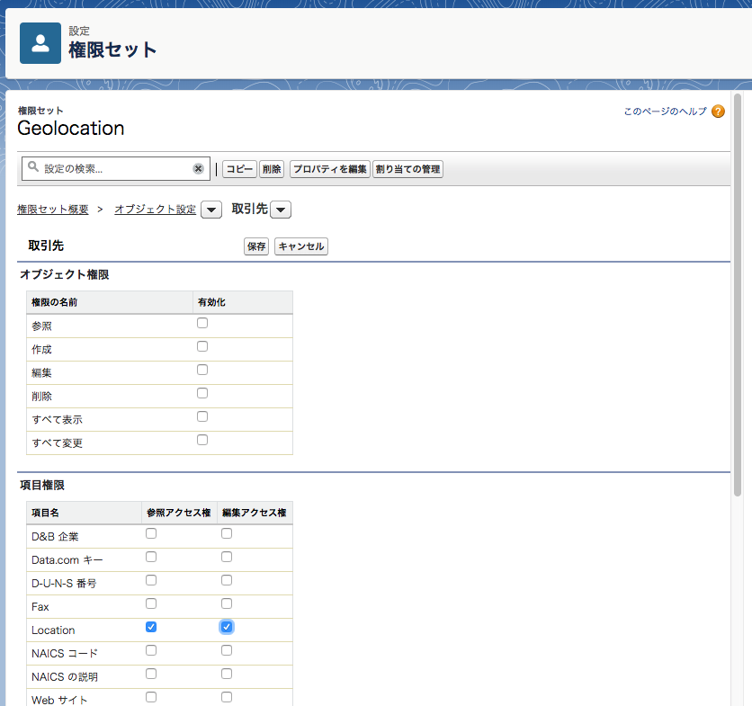

2. Get Ready to Create an App
=============================

この章では

* DX のサンプルプロジェクトを作成する
* Scratch Org を作成する
* カスタム項目や権限セットを作成し、ローカルに取り込む
* サンプルデータをインポート／エクスポートする

といったことを行います。

## プロジェクトを作成する

プロジェクトとは DX でアプリケーションを開発するための一連のファイル群を指します。  

```
$ sfdx force:project:create -n geolocation
```

を実行します。  
`geolocation` ディレクトリと、その下にファイルがいくつか作成されたかと思います。


（画像は https://trailhead.salesforce.com/ja/modules/sfdx_app_dev/units/sfdx_app_dev_create_app から引用）

重要なのは `sfdx-project.json` と `config/project-scratch-def.json` という 2 つの設定ファイルです。

### `sfdx-project.json`

このプロジェクトディレクトリに関する設定が記述されています。

* メタデータが格納されているディレクトリへのパス
* 名前空間（使う場合は）
* ログイン URL
* ソースコードの API バージョン

などがあります。詳細は [Salesforce DX プロジェクトの設定 | Salesforce DX 開発者ガイド](https://developer.salesforce.com/docs/atlas.ja-jp.210.0.sfdx_dev.meta/sfdx_dev/sfdx_dev_ws_config.htm) を参照。


### `config/project-scratch-def.json`

この後作成する Scratch Org に関する設定が記述されています。

* 組織名
* エディション
* 組織の各機能（Chatter, LEX, etc.）の有効無効

などがあります。詳細は [スクラッチ組織定義ファイル | Salesforce DX 開発者ガイド](https://developer.salesforce.com/docs/atlas.ja-jp.210.0.sfdx_dev.meta/sfdx_dev/sfdx_dev_scratch_orgs_def_file.htm) を参照。


## Scratch Org を作成する

それではいよいよ Scratch Org を作成します。

```
$ cd geolocation
$ sfdx force:org:create -s -f config/project-scratch-def.json -a GeoAppScratch
Successfully created scratch org: 00D0l0000000Y8gEAE, username: test-hnxv7auqt6rm@yamazaki_company.net

# オプション：
  -s これをプロジェクトのデフォルトの Scratch Org にする
  -f Scratch Org の設定ファイルへのパス
  -a エイリアス。Scratch Org を識別するための好きな文字列にする
```

`Successfully created...` が表示されれば OK です。

なお、このタイミングで `geolocation` の下に `.sfdx` ディレクトリが作成されますが `.gitignore` に追加しておくのが良いです。

> Whatever VCS you use, we recommend that you configure it to exclude the .sfdx folder from being added to the repository. This folder holds temporary information for your scratch orgs, so you don’t have to save it for posterity in your VCS. In Git, you would add it to the .gitignore file.

## カスタム項目の作成

これから開発するアプリケーションに必要になるため、取引先オブジェクトにカスタム項目を作成します。

```
$ sfdx force:org:open
```

で Scratch Org にログインします。

（LEX の場合）オブジェクトマネージャ > 取引先 > 項目とリレーション　から新規で以下のカスタム項目を作成します。

* データ型：地理位置情報
* 表示ラベル： `Location`
* 緯度および経度表示の表記法： `小数`
* 小数点の位置： `7`
* 項目名： `Location`

## 権限セットの作成

作成したカスタム項目への権限セットを作成します。ラベルは `Geolocation` とし、「オブジェクト設定」から取引先の Location 項目に対して参照および編集アクセス権を付与します。




作成したら、 `user:permset:assign` コマンドでユーザに権限セットを割り当てます。

```zsh
$ sfdx force:user:permset:assign -n Geolocation
=== Permsets Assigned
USERNAME                                PERMISSION SET ASSIGNMENT
──────────────────────────────────────  ─────────────────────────
test-hnxv7auqt6rm@yamazaki_company.net  Geolocation
```


## 変更をローカルに取り込む（Pull）

Scratch Org 上で GUI から行ったメタデータの変更をプロジェクトに反映させます。

```
$ sfdx force:source:pull
```

コマンドを実行します。


```
=== Pulled Source
STATE  FULL NAME                               TYPE           PROJECT PATH
─────  ──────────────────────────────────────  ─────────────  ─────────────────────────────────────────────────────────────────────────────────────
Add    Account.Location__c                     CustomField    force-app/main/default/objects/Account/fields/Location__c.field-meta.xml
...
```

こんな感じで差分が表示されるはずです。

このように、画面上で行った設定変更などは `force:source:pull` でローカルに取り込み、反対にローカル上で開発したソースコードなどは `force:source:push` で組織に反映させながら  
組織の状態とローカルのソースコードとの間で同期を取り、開発を進めていくことになります。


## サンプルデータを作成する

DX ではカスタムオブジェクト／項目や Apex などのメタデータだけでなく、レコードもソースコードと一緒に管理することができます。  
まず、画面上で取引先レコードを 3 件ほど作成します。項目値は以下とします。

| Account Name        | Latitude  | Longitude   |
|---------------------|-----------|-------------|
| Marriott Marquis    | 37.785143 | -122.403405 |
| Hilton Union Square | 37.786164 | -122.410137 |
| Hyatt               | 37.794157 | -122.396311 |

続いて、作成したレコードをローカルにエクスポートします。

```
$ mkdir data
$ sfdx force:data:tree:export -q "SELECT Name, Location__Latitude__s, Location__Longitude__s FROM Account WHERE Location__Latitude__s != NULL AND Location__Longitude__s != NULL" -d ./data
Wrote 3 records to data/Account.json
```

`data` ディレクトリの下に `Account.json` という JSON ファイルが作成されました。  
この JSON ファイルを使うことで、別の組織にも決められたデータセットをインポートすることができます。

ここでは使いませんが、データのインポートには次のコマンドを実行します。

```
$ sfdx force:data:tree:import --sobjecttreefiles data/Account.json
```


## おつかれさまでした！

この章はこれで終了です。  
ここまでの内容で Challenge も解答できるはずなので挑戦してみましょう。
