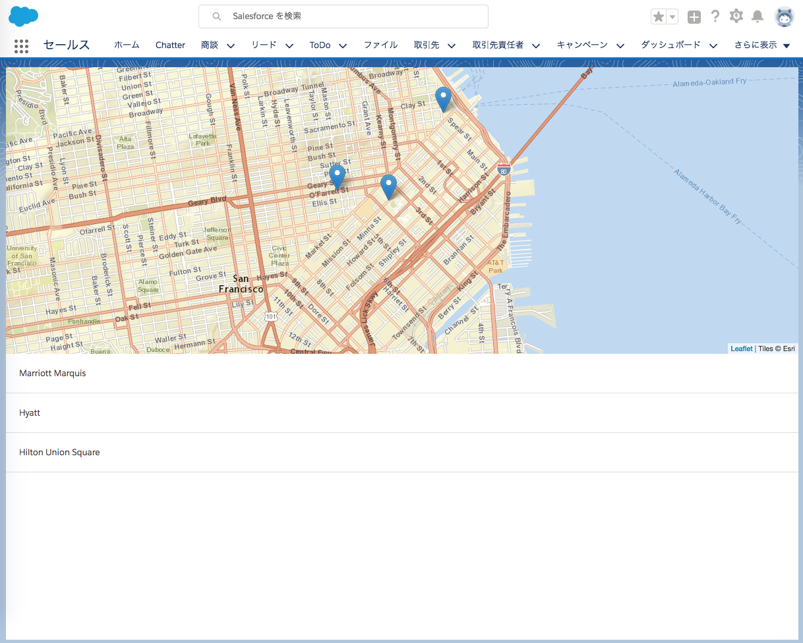

4. Build the Account Map Display
================================

この章では引き続き Geolocation アプリを作りつつ、完成したものをテスト用の別組織にデプロイして動作確認します。  
が、前章でアプリのソースコードについては省略してしまったので [Create a Lightning Event to Add Markers to the Map](https://trailhead.salesforce.com/ja/modules/sfdx_app_dev/units/sfdx_app_dev_create_visuals#Tdxn4tBK-heading4) の項までは済んでおり、アプリとしては完了しています。

試しに、Scratch Org でアプリを表示させてみましょう。

```
$ sfdx force:org:open
```

で Scratch Org を開きます。

Account Locator というタブが追加されましたが、権限を付与していないので付与します。  
権限セット `Geolocation` で設定すると良いでしょう。


権限が付与されると、アプリケーションランチャーから「Account Locator」にアクセスできるようになります。




このように表示されれば成功です。

## アプリケーションを検証する

ここまででアプリケーションが無事完成したことが確認できました。  
最後は動作確認ですが、テストには開発に使用した Scratch Org とは別の、まっさらな Scratch Org を新たに作成して  
そちらで検証するのが望ましいとされています。

これまでにやった一連の操作の繰り返しになりますが、新しい Scratch Org にアプリをデプロイしてみましょう。

```zsh
# 1. Scratch Org を作成（名前は GeoTestOrg）
$ sfdx force:org:create -f config/project-scratch-def.json -a GeoTestOrg

# 2. ソースコードをデプロイ
$ sfdx force:source:push -u GeoTestOrg

# 3. 権限セットを付与
$ sfdx force:user:permset:assign -n Geolocation -u GeoTestOrg

# 4. サンプルデータのインポート
$ sfdx force:data:tree:import -f data/Account.json -u GeoTestOrg

# 5. 組織を開く
$ sfdx force:org:open -u GeoTestOrg
```

`-u` で対象組織を指定できるみたいですね。

新しい GeoTestOrg でもアプリケーションが動作するのを確認できれば、この章は終了です。
